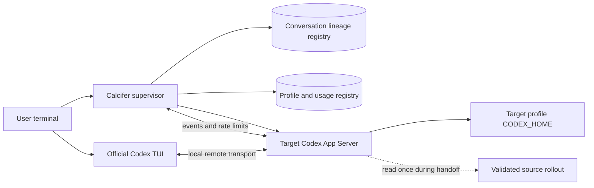

# ADR 0001: Treat conversation lineage as independent from credential profiles

- Status: Accepted for the failover design; implementation pending
- Date: 2026-07-15
- Upstream baseline: Codex CLI 0.144.4 (`8c68d4c87dc54d38861f5114e920c3de2efa5876`)

## Context

Calcifer gives every provider account an isolated credential profile. The first implementation also stores Codex sessions inside that profile's `CODEX_HOME`, which makes ordinary `codex resume <thread-id>` naturally profile-local.

That storage detail must not become a product limitation. A credential profile answers **which authorized account pays for and authenticates the next provider process**. A conversation answers **which persisted history the user is continuing**. After a profile is authoritatively exhausted, the intended experience is to stop that process, select the next eligible profile, and continue the same conversation without resubmitting the failed turn.

Codex 0.144.4 provides the pieces needed for a compatibility-gated implementation:

- the official TUI can connect to a local App Server with `--remote`;
- `thread/fork.path` can read a rollout outside the target `CODEX_HOME` and create a new thread from it;
- a persistent fork immediately materializes its own rollout under the target profile;
- the App Server connection that creates the fork is attached to its events, and a remote TUI can rejoin the running target thread by ID.

The external `path` field is explicitly experimental. Calcifer therefore cannot expose an unversioned arbitrary-path API or silently fall back when the installed provider is incompatible.

## Decision

Calcifer will model one user-visible conversation as a profile-independent lineage:

```text
logical conversation 8f4e...
  generation 0: profile work-a     -> Codex thread 019a... -> rollout A
  generation 1: profile work-b     -> Codex thread 019b... -> rollout B
  generation 2: profile work-c     -> Codex thread 019c... -> rollout C
```

Each provider process still has exactly one immutable credential profile. The logical conversation may move to another profile only between processes, after the previous process and App Server are stopped and reaped. A single handoff-coordinator lease serializes migrations. The running supervisor retains its existing source-profile lease, then reserves the target profile while holding the conversation lease; it does not try to reacquire its own source lease.

For the first supported Codex handoff implementation, Calcifer will prefer a **fork-by-path handoff**:

1. Observe a structured turn failure and revalidate authoritative exhaustion.
2. Acquire the handoff-coordinator and conversation leases, retain the already-held source-profile lease, and reserve a freshly revalidated target profile.
3. Stop and reap the source TUI and source App Server; verify that no turn is running while retaining the coordinator side of the source lease.
4. Canonicalize the source rollout path and prove that it is a single-link regular, current-user-owned file under a Calcifer-managed Codex sessions root.
5. Persist and `fsync` a prepared-transition record containing the source fingerprint and intended target.
6. Start the target profile's App Server with the target profile's unchanged `CODEX_HOME` and credentials.
7. Negotiate an explicitly supported Codex version/schema with `experimentalApi: true`.
8. Call `thread/fork` with required `threadId: ""`, the non-empty validated source rollout `path`, canonical working directory, and source thread's effective model/sandbox/approval settings. Codex ignores the empty lookup ID when `path` is non-empty; authentication and provider routing remain target-profile-owned.
9. Verify that the response has a new thread ID, the expected `forkedFromId`, and a new regular rollout under the target profile; also verify that the source rollout content and identity are unchanged.
10. Atomically record the returned target thread ID, target rollout path, profile ID, generation, and interruption state.
11. Attach the official TUI with `codex resume --remote <local-socket> <target-thread-id>` and require that rejoin to succeed before accepting input.
12. Keep the supervisor connection event-only: it may observe notifications and query usage but never answers approval or other server-initiated requests. The attached official TUI is their sole responder, and a new turn is not allowed while it is absent.
13. Release the source-profile and transition leases only after the target generation is committed and attached; retain the target-profile lifetime lease.
14. Display the source alias, target alias, reason, and lineage generation without exposing provider account identifiers.

The user-visible operation is called **resume after failover** even though Codex creates a new provider thread internally. The persisted conversation history is preserved, while each generation has a single profile-local writer. This is a conversation checkpoint, not restoration of a dead process, live stream, terminal state, or in-flight tool process.

Calcifer will not automatically resend the failed prompt. A quota error may occur after tools have already changed files or external systems, so transcript continuity and turn replay are separate operations.

## Runtime containers



The supervisor is the only component that decides to migrate a lineage. The official TUI remains the interactive UI, and the official App Server remains the owner of provider authentication, turns, persistence, and structured usage events.

## Handoff sequence

```mermaid
sequenceDiagram
    participant TUIA as TUI / profile A
    participant ASA as App Server / profile A
    participant C as Calcifer supervisor
    participant ASB as App Server / profile B
    participant TUIB as TUI / profile B

    ASA-->>C: turn/completed: usageLimitExceeded
    C->>ASA: account/rateLimits/read
    ASA-->>C: explicit exhausted state
    C->>TUIA: terminate and wait
    C->>ASA: stop, flush, and reap
    C->>C: validate source rollout; fsync prepared transition
    C->>ASB: start with profile B CODEX_HOME
    C->>ASB: initialize(experimentalApi=true)
    C->>ASB: thread/fork(threadId="", path + effective settings)
    ASB-->>C: target thread ID and target rollout path
    C->>C: verify lineage, target containment, source unchanged
    C->>C: atomically commit generation B
    C->>TUIB: codex resume --remote socket target-thread-id
    TUIB->>ASB: rejoin target thread
    C->>C: enable input; observe only
```

## State and recovery

The lineage transition is an atomic state machine, not a best-effort chain of subprocess calls:

```text
running(source)
  -> exhaustion_confirmed(source)
  -> source_stopped(source_rollout)
  -> target_starting(target_profile, attempt_id)
  -> target_forked(target_thread, target_rollout)
  -> running(target)
```

`thread/fork` has no Calcifer-controlled idempotency key. The prepared transition is therefore durable before the request is sent, and recovery rules are conservative:

- Before `source_stopped`, the source generation remains authoritative.
- After `source_stopped` but before a target fork exists, retrying may start a target App Server, but it must not replay a turn.
- After `target_forked`, Calcifer must persist the returned target identity before launching the TUI.
- If Calcifer crashes after sending `thread/fork` but before committing its response, recovery lists target-profile threads and may adopt exactly one candidate whose `forkedFromId`, creation window, canonical target path, and prepared-transition metadata all match. Zero candidates permits one retry; multiple candidates or any mismatch fail closed for explicit user reconciliation.
- Failure to start or validate the target never deletes, truncates, or rewrites the source rollout.
- A pool is traversed at most once per user invocation. An exhausted or unknown pool terminates with the lineage still resumable.

## Invariants

1. Credential profiles and conversation lineages have different identifiers and lifecycles.
2. One provider process has one immutable credential profile.
3. One lineage generation has one rollout writer, and a handoff fork must materialize a distinct target-profile rollout before activation.
4. Source and target profiles belong to the same explicit provider trust domain.
5. The source process is stopped and reaped before the target fork is created.
6. A rollout path comes only from Calcifer-owned metadata and passes canonical containment, owner, mode, type, hard-link, and symlink checks.
7. Unsupported provider versions or schemas stop before reading an external rollout.
8. Unknown, stale, authentication, network, and provider failures do not authorize failover.
9. Resume preserves history but never automatically replays an interrupted turn.
10. Credentials remain in their profile homes; Calcifer does not copy `auth.json` into a shared runtime home.
11. The supervisor is an event observer, not an approval responder; the official TUI must be attached before a new turn can start.
12. Lease descriptors are held by Calcifer guardians and are not inherited by the App Server, TUI, or provider-started tools; the guardian tracks and reaps the exact App Server PID.

## Alternatives considered

### Resume the external rollout in place

`thread/resume.path` preserves the original Codex thread ID, but the resumed recorder appends to the source rollout path. That requires a cross-profile writer lease for the lifetime of the target process and leaves conversation storage owned by the first credential profile. It remains a possible compatibility fallback, but it is not the preferred first implementation.

### Shared runtime `CODEX_HOME`

A shared runtime home makes stable `codex resume <thread-id>` work after credential replacement. It also requires copying credentials into the runtime, detecting token refresh, writing newer credentials back to the correct profile, resolving refresh races, and rolling back partial activation. Calcifer rejects that additional credential mutation while the fork-by-path design is available.

### Copy a rollout into the target home manually

Provider-owned rollout and SQLite formats are not a documented import API. Copying files can leave stale indexes, duplicate writers, or incomplete subagent/session state. Calcifer uses the provider's own App Server import path instead.

### Start a fresh thread after failover

This loses the interaction continuity the product is meant to provide. A fresh thread is only an explicit recovery option when the version-gated handoff is unavailable; it is never the silent success path.

## Compatibility gate

The handoff adapter must:

- allow only tested Codex release versions;
- generate and diff the installed App Server schema with `codex app-server generate-json-schema --experimental --out <dir>` in CI, because the default schema intentionally omits `thread/fork.path`;
- run a version-pinned protocol smoke test that initializes with `experimentalApi: true`, forks a synthetic Calcifer-owned rollout by `path`, and verifies the new ID, `forkedFromId`, target containment, and unchanged source; schema presence alone does not prove runtime behavior;
- require the expected `thread/fork.path`, remote TUI, thread response, and error shapes;
- use a private local transport and never expose the App Server remotely;
- fail closed without modifying source or target state when compatibility cannot be proven.

The baseline source contracts are:

- [Codex CLI remote and resume reference](https://developers.openai.com/codex/cli/reference/)
- [App Server protocol](https://developers.openai.com/codex/app-server/)
- [`ThreadForkParams.path` and `ThreadResumeParams.path`](https://github.com/openai/codex/blob/8c68d4c87dc54d38861f5114e920c3de2efa5876/codex-rs/app-server-protocol/src/protocol/v2/thread.rs#L310-L600)
- [fork implementation and target rollout materialization](https://github.com/openai/codex/blob/8c68d4c87dc54d38861f5114e920c3de2efa5876/codex-rs/app-server/src/request_processors/thread_processor.rs#L3444-L3721)
- [resume recorder appends to the supplied rollout path](https://github.com/openai/codex/blob/8c68d4c87dc54d38861f5114e920c3de2efa5876/codex-rs/rollout/src/recorder.rs#L813-L826)

## Consequences

- Cross-profile conversation continuation is a required part of automatic failover, not an optional follow-up.
- A Calcifer logical conversation ID remains stable while the provider thread ID changes at each handoff.
- The lineage registry and conversation lease become first-class state alongside credential profiles.
- The supervised path must use App Server plus remote TUI; the current direct `run` and same-profile `resume` commands remain available and unchanged.
- The feature stays disabled until the version gate, transition recovery, pool policy, and adversarial path/lock tests are implemented.
