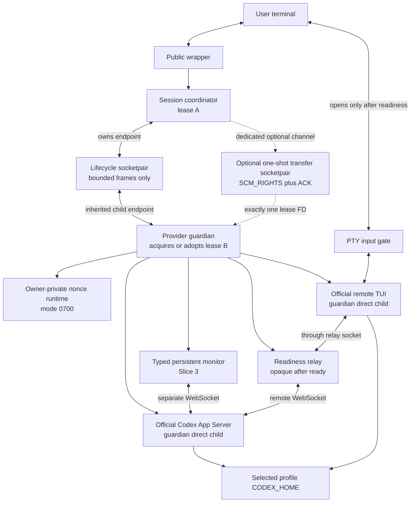

# ADR 0003: Supervise a profile-owned Codex App Server and official remote TUI

- Status: Accepted for staged implementation in issues #33 and #48
- Date: 2026-07-15
- Upstream baseline: Codex CLI 0.144.4 (`8c68d4c87dc54d38861f5114e920c3de2efa5876`)
- Related decisions: [ADR 0001](0001-cross-profile-conversation-handoff.md), [ADR 0002](0002-private-provider-identity-binding.md)

## Context

Calcifer's direct `run` and `resume` paths start the official Codex CLI below a
provider guardian. A coordinator owns profile lease A, the guardian owns lease
B, and provider descendants inherit neither descriptor. Those paths already
support isolated profiles and same-profile cold resume without copying
credentials or replaying a prompt.

Continuous rate-limit observation and safe future failover require a different
topology: Calcifer must own an App Server for the selected profile and attach
the official TUI through Codex's remote transport. The TUI must remain the sole
interactive client and sole responder to approvals and other provider-initiated
requests. Calcifer may observe bounded metadata and issue explicitly reviewed
read-only requests; it must never become an alternate agent UI.

Issue #28 proved a pinned Codex 0.144.4 schema, synthetic fork, App Server, and
remote-TUI sequence in a credential-free scratch environment. Its proxy is a
short-lived compatibility probe, not a production supervisor: its policy is
synthetic-fork-specific, its PTY is a bounded smoke-test capture, and it owns no
real profile or long-lived provider process.

Issue #32 added a no-gap type-state lease-transfer primitive using
`SCM_RIGHTS`. It remains internal until the receiving guardian and ambiguous
ACK outcomes have a complete process supervisor.

## Decision and initial scope

Calcifer will add a Linux/macOS-only, explicit, default-off supervised session
path. The first public form will resume one canonical existing thread in one
explicit profile. Existing direct `run`, exact `resume`, workspace-head
`resume`, and `status` remain independent and unchanged.

Implementation is divided into four slices. Issue #48 implements only the
first: a bounded readiness-relay transport kernel extracted from #28. It does
not start an App Server, open a second monitor connection, spawn a child, own a
lease, bridge a terminal, query usage, or expose a CLI option.

The production supervisor will reuse the reviewed transport mechanics, but not
the synthetic readiness policy or probe PTY. The provider guardian will own
lease B and be the direct parent of both the App Server and official TUI. The
coordinator will retain lease A and communicate with the guardian over an
inherited connected socketpair.

## Process topology



App Server, TUI, tools, monitor helpers, relay workers, and unrelated
concurrent children inherit zero lease or coordinator-control descriptors.

## Component responsibilities

| Component | Owns | Must not do |
| --- | --- | --- |
| Public wrapper | User-facing invocation and final shell disposition | Read credentials, speak provider protocol, or silently fall back to direct mode |
| Coordinator | Immutable profile selection, lease A, guardian child handle, terminal restoration | Spawn provider children itself or treat a PID as lease authority |
| Guardian | Lease B, App Server/TUI child handles, private runtime, shutdown order | Spawn provider children before B is committed or release B before complete cleanup |
| App Server | Official selected-profile provider session | Inherit A, B, lifecycle, transfer, or PTY-control descriptors |
| Readiness relay | Transparent TUI byte path and pre-readiness bounded observation | Manufacture provider responses or retain transcript payloads |
| Typed monitor | A separate reviewed protocol connection introduced in Slice 3 | Expose generic `send(Value)`, `respond`, approval, or arbitrary-method APIs |
| Terminal bridge | Fixed-size streaming and terminal state restoration | Forward user input before the guardian publishes exact readiness |

The #48 relay inspects only until readiness. It then becomes an opaque byte
relay. It is not the future persistent monitor.

## Control-channel contract

The lifecycle and lease-transfer channels are separate socketpairs with
different single-reader authorities.

### Lifecycle socketpair

- Carries bounded typed lifecycle frames only.
- Has no ancillary-data receive path and never calls `recvmsg` for FDs.
- Is created close-on-exec; every endpoint is read back before spawn.
- Uses the audited child-only inheritance seam so only the selected guardian
  endpoint survives guardian `exec`.
- Is absent from App Server, TUI, tools, and unrelated concurrent execs.

The coordinator accepts child PID/PGID reports only for best-effort containment.
Exact wait authority for App Server and TUI remains in the guardian's direct
`Child` handles.

### Optional lease-transfer socketpair

- Exists only when the guardian must adopt an already-held B.
- Has one single-threaded `recvmsg` reader and no buffered or lifecycle reader.
- Carries exactly one reviewed marker, exactly one descriptor, and exactly one
  ACK, all under deadlines.
- On Linux, receives with `CMSG_CLOEXEC`. On macOS, no worker creation,
  fork, or spawn is allowed between `recvmsg`, `FD_CLOEXEC` set/readback, lock
  identity validation, and ACK.
- Closes both channel endpoints immediately after commit and is never reused.

Before ACK, the coordinator retains A+B and the guardian's B is provisional.
The guardian may spawn no worker or provider child. If ACK is missing or
ambiguous, the coordinator retains A+B, terminates and exactly waits for its
direct guardian child, and releases only after the guardian copy is known
closed. This proof is valid because no other process could inherit B before
commit; it is not proof that later App Server/TUI grandchildren were reaped.

## Readiness-relay protocol contract

Issue #48 supplies two separate policies over one bounded transport kernel.

### Synthetic #28 policy

The compatibility proof keeps its existing sequence and exact synthetic
settings:

1. target `thread/read` success;
2. target `thread/resume` success with exact synthetic settings and expected
   `forkedFromId`;
3. source-parent `thread/read` with a matching valid error response.

### Same-profile exact-resume policy

The production policy follows the pinned official TUI 0.144.4 behavior:

1. exact target `thread/read`; `includeTurns` is absent or false;
2. matching success response whose `thread.id` is the target;
3. exact target `thread/resume` with `history` absent/null and `path`
   absent/null/empty, so neither can override `threadId`;
4. matching success response whose `thread.id` is the target and whose
   canonical cwd matches the selected workspace;
5. capture bounded effective model, provider, approval policy, reviewer, and
   sandbox evidence from the response;
6. if `thread.forkedFromId` is a UUID, wait for the exact parent
   metadata-only `thread/read` and its matching success or valid error;
7. publish readiness only after the final relevant response bytes have been
   written to the TUI and relay health is still valid.

The pinned approval projection accepts stable string policies and the
experimental granular object used by an official remote TUI initialized with
`experimentalApi: true`. Sandbox evidence accepts only the four pinned policy
shapes. Duplicate JSON keys are rejected at every nesting level.

Provider responses, notifications, and provider-initiated requests are
classified separately. A provider request is forwarded to the TUI, but the
relay has no response API and emits zero bytes of its own. Unknown payloads are
not logged or retained.

## Supervised exact-resume sequence

```mermaid
sequenceDiagram
    participant U as User terminal
    participant C as Coordinator / A
    participant G as Guardian / B
    participant A as App Server
    participant M as Typed monitor
    participant R as Readiness relay
    participant T as Official TUI

    U->>C: explicit supervised resume(profile, UUID)
    C->>C: validate and acquire A
    C->>G: spawn over lifecycle socketpair
    G->>G: acquire/adopt B and commit
    G->>G: verify pinned build and create private runtime
    G->>A: spawn exact build with selected CODEX_HOME
    G->>M: initialize separate typed monitor
    G->>R: bind owner-only relay socket
    G->>T: spawn exact resume over PTY and relay
    Note over U,T: user-input gate remains closed
    T->>A: thread/read(target; includeTurns omitted)
    A-->>T: target metadata
    T->>A: thread/resume(target; history/path absent)
    A-->>R: target plus effective settings
    R-->>T: forward response bytes
    opt forkedFromId is present
        T->>A: thread/read(parent; includeTurns omitted)
        A-->>R: parent metadata or valid JSON-RPC error
        R-->>T: forward parent response bytes
    end
    R-->>G: typed readiness evidence
    G-->>C: READY plus containment-only PID/PGID reports
    C->>U: open input gate
    U->>T: interactive input
    T-->>G: exit code or terminating signal
    G->>G: stop children; exact wait; join workers; clean sockets
    G-->>C: CHILDREN_REAPED plus structured disposition
    C->>C: exact wait for guardian
    C-->>U: reproduce trusted TUI disposition
```

## Lifecycle and guardian-loss state

```mermaid
stateDiagram-v2
    [*] --> Validating
    Validating --> Guarded: A and committed B held
    Guarded --> AppServerStarting
    AppServerStarting --> MonitorStarting: socket verified
    MonitorStarting --> TuiStarting: monitor initialized
    TuiStarting --> AwaitingReadiness: input closed
    AwaitingReadiness --> Running: exact readiness published
    Running --> Stopping: TUI exit or requested signal
    Validating --> Failed
    AppServerStarting --> Failed
    MonitorStarting --> Failed
    TuiStarting --> Failed
    AwaitingReadiness --> Failed
    Running --> Failed: child, monitor, or relay failure
    Failed --> Stopping: guardian remains alive
    Stopping --> Reaped: direct children waited; workers joined
    Reaped --> [*]: CHILDREN_REAPED trusted

    Validating --> GuardianLost: guardian dies unexpectedly
    Guarded --> GuardianLost
    AppServerStarting --> GuardianLost
    MonitorStarting --> GuardianLost
    TuiStarting --> GuardianLost
    AwaitingReadiness --> GuardianLost
    Running --> GuardianLost
    Stopping --> GuardianLost
    GuardianLost --> CoordinatorFailClosed
    CoordinatorFailClosed --> CoordinatorFailClosed: retain A; no automatic release
```



When the guardian remains alive, it is the exact direct-child reaper. If the
guardian dies unexpectedly, the coordinator can exactly wait only for its
direct guardian child. On macOS it cannot `wait(2)` for reparented App
Server/TUI grandchildren. Reported process groups may be signalled for
containment, but EOF, `killpg` success, PID disappearance, and `ESRCH` are not
reap or identity proofs. Without a previously received `CHILDREN_REAPED`
terminal frame, the coordinator parks with A held and requires explicit
process-level recovery. It must not exit and accidentally release A.

## Invariants

1. One supervised tree uses one immutable profile, canonical `CODEX_HOME`, and
   one verified Codex build identity.
2. A is acquired before B; no provider process exists before B is committed.
3. At least one Calcifer-owned lease remains held while a provider tree is live
   or ambiguously live.
4. Only coordinator A and guardian B are lease authorities; PIDs, sockets,
   registry rows, and markers are not authorities.
5. App Server, TUI, tools, and unrelated children inherit zero lease/control
   descriptors.
6. The guardian's live `Child` handles are the only exact App Server/TUI wait
   authority.
7. User input reaches the PTY only after exact target readiness, downstream
   response forwarding, and relay-health confirmation.
8. The official TUI is the only responder to provider-initiated requests.
9. No prompt, turn, approval, command, tool argument, or terminal transcript is
   replayed, persisted, or included in diagnostics.
10. Handshake, frame, fragment, semantic strings, queues, buffers, and every
    lifecycle phase are bounded.
11. Disconnect after readiness is a transport failure until intentional
    shutdown begins.
12. Cleanup unlinks only the recorded owner/type/device/inode pathname; a
    replacement is preserved and reported.
13. Infrastructure and cleanup failures fail loudly and cannot be flattened
    into a successful TUI exit.
14. Unsupported platforms/builds/contracts fail explicitly and never trigger a
    silent direct-mode fallback.

## Bounds and backpressure

| Input or retained projection | Initial bound | Saturation behavior |
| --- | ---: | --- |
| WebSocket handshake | 16 KiB | Reject before further accumulation |
| WebSocket message across fragments | 1 MiB | Reject declared or aggregate overflow |
| Frame decoder buffer | 1 MiB plus maximum header | Reject before extending allocation |
| Thread ID or string request ID | 256 bytes | Reject the exchange |
| Method | 256 bytes | Reject the envelope |
| Canonical cwd or writable root | 16 KiB | Reject invalid/non-absolute values |
| Model | 512 bytes | Reject typed evidence |
| Model provider | 256 bytes | Reject typed evidence |
| Approval/reviewer/sandbox tag | 128 bytes | Reject typed evidence |
| Workspace writable roots | 64 entries | Reject typed evidence |
| Observation queue | 32 events | Synchronous bounded backpressure |
| Readiness result | 1 event | One-shot bounded delivery |
| Terminal relay | Fixed streaming buffers | Never accumulate a transcript |

Connect, initialize, readiness, lease transfer, ACK, graceful shutdown,
forced termination, and worker join each have explicit deadlines. A timeout
keeps input closed and enters checked shutdown.

## Socket policy and threat boundary

Every pathname socket lives under a current-user-owned mode-`0700` nonce
directory. Destinations must be absent before bind. After bind, Calcifer
requires the requested local address, socket type, current UID, mode `0600`,
and records pathname device/inode before any client connects.

An AF_UNIX descriptor's `fstat` inode is the kernel socket object, not the
filesystem pathname inode on Linux/macOS, so it is not a portable binding proof
for the visible node. Security instead relies on the private parent, local
address verification, repeated pathname identity checks, and
identity-conditioned cleanup. A malicious process already running as the same
UID can still race pathname operations; Calcifer's local threat model does not
claim to sandbox same-UID malware.

Collision, symlinked or permissive parent, wrong owner/type/mode, path
replacement, and overlong path fail closed. Cleanup never blindly unlinks.

## Failure, exit, and recovery policy

| Event | Required result |
| --- | --- |
| Validation/capability failure | Start no profile provider process |
| App Server/socket failure | Start no TUI; terminate and exactly wait any started direct child |
| Monitor failure | Keep input closed; stop and wait App Server |
| TUI/readiness failure | Keep input closed; stop/wait both children; join workers |
| Malformed, oversized, wrong-target, wrong-source, or out-of-order protocol | Fail session; never retry or replay |
| Unexpected App Server/monitor/relay exit | Stop TUI and report infrastructure failure even if TUI exits zero |
| TUI normal/nonzero exit | Preserve its code only after verified cleanup |
| TUI terminating signal | Preserve structured signal; restore terminal and reproduce shell disposition after cleanup |
| Coordinator death | Live guardian B closes input, stops/waits direct children, then releases B |
| Guardian death before trusted terminal frame | Coordinator exactly waits guardian, best-effort contains reported groups, parks with A held |
| Missing/invalid transfer ACK | Retain A+B; terminate and exactly wait pre-spawn guardian before release |
| Socket identity mismatch at cleanup | Preserve replacement and report cleanup failure |

The coordinator may trust a TUI exit code/signal only when the same lifecycle
stream delivered `CHILDREN_REAPED { tui_disposition, app_server_disposition,
workers_joined, cleanup_ok }` and the coordinator then exactly waited for its
guardian child. Channel EOF or abnormal guardian exit yields an operational
failure, never a reconstructed TUI success.

## P0 gates

| Gate | Required evidence before public exposure |
| --- | --- |
| Input authority | Real PTY sentinel proves zero pre-ready input; every wrong-target/order/error/timeout/disconnect case keeps the gate closed |
| Observe-only authority | Provider request is byte-for-byte forwarded; upstream silence window proves zero Calcifer response bytes; no generic response API exists |
| Bounds/privacy | Exact-limit and limit-plus-one tests, duplicate-key rejection, deterministic queue backpressure, and sentinel absence from logs/files |
| Socket integrity | Parent/symlink/collision/mode/replacement/timeout/disconnect/cleanup cases and mode-`0600` readback |
| Lease integrity | Real exec FD scans, no-gap A/B tests, dedicated transfer/lifecycle reader tests, ambiguous ACK and concurrent-writer tests |
| Live lifecycle | Every injected failure while guardian lives exactly waits children and joins workers; stuck descendants escalate within bounds |
| Guardian loss | Coordinator claims exact wait only for guardian, does not claim grandchild reap on macOS, and retains A indefinitely without `CHILDREN_REAPED` |
| Exit/signals | 0/nonzero/signal semantics, HUP/INT/QUIT/TERM forwarding, WINCH, suspend/continue, and terminal restoration |
| Compatibility | Existing #28 packaged 0.144.4 proof, exact build revalidation at spawn, and schema/sequence drift rejection |
| Regression/platform | Direct run/resume/status unchanged; Linux/macOS green; Windows and unreviewed Unix explicit unsupported |

## Staged implementation

### Slice 1: bounded readiness-relay kernel (#48)

- Move handshake/frame/fragment/socket/relay mechanics out of #28-specific
  compatibility code.
- Preserve the synthetic policy as a regression consumer.
- Add response/notification/provider-request classification, duplicate-key and
  semantic bounds, exact-resume policy, typed effective settings, lineage-aware
  parent lookup, and mode-`0600` identity-conditioned sockets.
- Keep the relay opaque after readiness.
- Add no App Server ownership, persistent connection, subscription, usage
  loop, child spawn, lease, terminal bridge, cache, schema, or CLI behavior.

### Slice 2: guardian-owned fake process foundation

- Add lifecycle and separate optional transfer socketpairs.
- Add guardian-owned fake App Server/TUI process groups, private runtime,
  socket verification, PTY bridge, input gate, signals, structured disposition,
  and bounded shutdown.
- Exercise phase-barrier fault injection without a live provider or public CLI.

### Slice 3: pinned same-profile provider integration

- Introduce a sealed capability that retains or launch-time revalidates the
  exact executable; App Server and TUI use the same build identity.
- Add the separate typed monitor, reviewed initialization/subscription, usage
  reads, and official TUI through the readiness relay.
- Exercise through an internal test entrypoint only.

### Slice 4: explicit public exact resume

- Add an explicit form such as:

  ```text
  calcifer resume --experimental-supervised codex@work <thread-uuid>
  ```

- Reject new run, `--last`, implicit workspace selection, remote overrides,
  cross-profile fork, pool traversal, and automatic failover in this path.
- Expose only after all P0 gates pass on Linux and macOS.

Before Slice 4, all new code remains internal and default-unused. No slice may
publish a command that merely returns “not implemented” or silently delegates
to direct mode.

## Pinned upstream boundary

Calcifer treats the App Server and remote TUI as version-scoped adapters, not a
cross-version stable extension API. The reviewed baseline includes:

- `app-server --listen unix://...` and official `resume --remote unix://...`;
- per-connection initialize behavior and multiple local connections;
- [`ThreadReadParams` false-field omission](https://github.com/openai/codex/blob/8c68d4c87dc54d38861f5114e920c3de2efa5876/codex-rs/app-server-protocol/src/protocol/v2/thread.rs#L1271-L1284);
- [`ThreadResumeParams` history/path precedence](https://github.com/openai/codex/blob/8c68d4c87dc54d38861f5114e920c3de2efa5876/codex-rs/app-server-protocol/src/protocol/v2/thread.rs#L310-L352);
- [official TUI resume and conditional parent lookup](https://github.com/openai/codex/blob/8c68d4c87dc54d38861f5114e920c3de2efa5876/codex-rs/tui/src/app_server_session.rs#L492-L613);
- [pinned approval policy variants](https://github.com/openai/codex/blob/8c68d4c87dc54d38861f5114e920c3de2efa5876/codex-rs/app-server-protocol/src/protocol/v2/shared.rs#L158-L207); and
- pinned sandbox policy shapes, effective settings, socket behavior, and
  bounded WebSocket framing exercised by #28.

A changed executable, schema, sequence, field projection, socket behavior, or
runtime proof fails closed and requires a reviewed adapter. A version string or
successful WebSocket upgrade alone is never capability evidence. Final
production spawn must use the verified build without a PATH lookup TOCTOU.

## Alternatives considered

| Alternative | Why rejected or deferred |
| --- | --- |
| Reuse #28 proxy/PTY unchanged | Synthetic lineage and capture semantics are not a production terminal supervisor |
| Coordinator directly parents App Server/TUI | Process wait authority would diverge from guardian-held lease B |
| Pathname coordinator/guardian listener | First-connector and stale-path races are unnecessary; inherited socketpair binds the selected child |
| Multiplex transfer and lifecycle frames | Ancillary FD ownership and lifecycle framing require independent single-reader channels |
| Put a semantic monitor permanently in the TUI byte path | Expands authority and failure blast radius; readiness relay should become opaque |
| Persist compatibility/usage cache now | Invalidation and ownership policy belong to later slices; live evidence is required first |

## Migration and rollback

The staged work changes no credential layout, profile registry, conversation
schema, rollout, default pointer, or direct command. It does not copy
`auth.json`, share a runtime `CODEX_HOME`, migrate a thread, or replay input.

Before Slice 4, reverting removes only internal code and tests. After Slice 4,
disabling the explicit supervised option leaves direct exact resume available
for the same profile-local thread. A failed supervised attempt reports failure,
preserves user data, and never silently retries through direct mode.

Private cleanup occurs only after identity checks. Replacements and ambiguous
guardian-loss state are deliberately preserved for explicit recovery rather
than hidden by destructive cleanup.

## Consequences

- Process and lease authority are co-located in the live guardian.
- Guardian loss is intentionally availability-expensive: without trusted
  terminal evidence, lease A remains held instead of risking a second writer.
- The transport kernel is reusable but version-scoped and authority-limited.
- The first public supervised feature is exact same-profile resume; usage-based
  switching and cross-profile handoff remain later, separately gated work.
