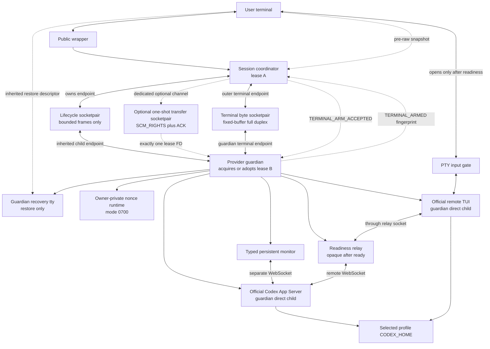

# ADR 0003: Supervise a profile-owned Codex App Server and official remote TUI

- Status: Accepted design; internal foundations #48/#50/#52 and the default-unused #54 provider implementation are present; local #55 recovery evidence is green and Ubuntu 24.04/macOS matrix acceptance is pending
- Date: 2026-07-15
- Last updated: 2026-07-20
- Upstream baseline: Codex CLI 0.144.4 (`8c68d4c87dc54d38861f5114e920c3de2efa5876`)
- Related decisions: [ADR 0001](0001-cross-profile-conversation-handoff.md), [ADR 0002](0002-private-provider-identity-binding.md)

## Context

Calcifer's direct `run` and `resume` paths start the official Codex CLI below a
provider guardian. A coordinator owns profile lease A, the guardian owns lease
B, and provider descendants inherit neither descriptor. Those paths already
support isolated profiles and same-profile cold resume without copying
credentials or replaying a prompt.

Continuous rate-limit observation and safe future failover require a different
topology: Calcifer must own an App Server for the selected profile and attach
the official TUI through Codex's remote transport. The TUI must remain the sole
interactive client and sole responder to approvals and other provider-initiated
requests. Calcifer may observe bounded metadata and issue explicitly reviewed
read-only requests; it must never become an alternate agent UI.

Issue #28 proved a pinned Codex 0.144.4 schema, synthetic fork, App Server, and
remote-TUI sequence in a credential-free scratch environment. Its proxy is a
short-lived compatibility probe, not a production supervisor: its policy is
synthetic-fork-specific, its PTY is a bounded smoke-test capture, and it owns no
real profile or long-lived provider process.

Issue #32 added a no-gap type-state lease-transfer primitive using
`SCM_RIGHTS`. It remains internal until the receiving guardian and ambiguous
ACK outcomes have a complete process supervisor.

Issue #50 adds the default-unused process-authority foundation with synthetic
children only. It proves the dedicated lifecycle channel, coordinator A and
guardian B ownership, guardian-direct process groups, exact child waits,
bounded worker shutdown, identity-conditioned runtime cleanup, and retained-A
guardian-loss behavior through real `exec` fault injection. It does not launch
Codex, bridge a PTY, query usage, read credentials, or expose a command.
The one-reader `SCM_RIGHTS` transfer and ACK proof remains the issue #32
primitive; issue #50 proves that its reserved transport is physically distinct
from lifecycle traffic, close-on-exec, and absent after child `exec`.

Issue #52 adds the Linux/macOS terminal-authority foundation around those fake
children. It proves a real controlling PTY, a physically absent input worker
until a typed readiness/raw-mode/open-gate handshake completes, fixed-buffer
full-duplex streaming, terminal restoration, signal and job-control semantics,
and redundant coordinator/guardian recovery. It remains behind
`internal-supervisor-fixture`; it does not launch real Codex, read credentials,
monitor usage, persist terminal data, or add a public command.

Issue #54 connects those authorities to the pinned `0.144.4` App Server, a
separate typed monitor, the readiness relay, and the official remote TUI behind
an internal entrypoint. It adds the production-shaped terminal anchor, exact
completion record, move-only provider-release gate, and fail-closed App drain.
Independently budgeted checksum-pinned normal-session and retained-recovery
package scenarios are configured to exercise the production coordinator,
guardian, provider-session, PTY, input-gate, resize, and stop/resume job-control
implementations under a test-owned terminal harness. The normal scenario passed
twice consecutively and retained recovery once from the 2026-07-20 Issue #54
candidate source on Apple silicon; Ubuntu 24.04/macOS matrix readback remains pending. Both scenarios perform selected-profile
admission through the production A-to-B lease path, and their guardian helper
enters the shared production guardian-bootstrap core. A package-only post-
admission loopback rewrite and fixed observation root are the two bootstrap
variations; production supplies neither. The package parent is designed to pass
the completion endpoint across real parent-to-coordinator and coordinator-to-
guardian `exec` boundaries, then accept only the exact frame plus EOF after the
guardian consumes provider-release proof. The test-only role dispatcher and
outer-terminal harness do not execute the production
`CALCIFER_INTERNAL_CODEX_SUPERVISOR_ROLE` dispatcher/parser or persistent
shell-anchor role, and these scenarios make no parser coverage claim.
Issue #54 still exposes no public supervised run/resume or failover command and
does not implement a cross-profile transition journal.

## Decision and initial scope

Calcifer will add a Linux/macOS-only, explicit, default-off supervised session
path. The first public form will resume one canonical existing thread in one
explicit profile. Existing direct `run`, exact `resume`, workspace-head
`resume`, and `status` remain independent and unchanged.

Implementation is divided into staged foundations and integrations. Issue #48
implements the bounded readiness-relay transport kernel extracted from #28,
issue #50 implements process authority with fake children, issue #52 implements
the terminal kernel, and issue #54 supplies the default-unused pinned provider
integration. The provider guardian owns lease B and is the direct parent of the
App Server and official TUI; the coordinator retains lease A and communicates
with the guardian over inherited connected socketpairs. Public command routing,
active-session selection, and cross-profile transition state remain separate
later slices.

## Process topology



App Server, TUI, tools, monitor helpers, relay workers, and unrelated
concurrent children inherit zero lease or coordinator-control descriptors.

## Component responsibilities

| Component | Owns | Must not do |
| --- | --- | --- |
| Public wrapper | User-facing invocation and final shell disposition | Read credentials, speak provider protocol, or silently fall back to direct mode |
| Coordinator | Immutable profile selection, lease A, guardian child handle, terminal restoration | Spawn provider children itself or treat a PID as lease authority |
| Guardian | Lease B, App Server/TUI child handles, private runtime, shutdown order | Spawn provider children before B is committed or release B before complete cleanup |
| App Server | Official selected-profile provider session | Inherit A, B, lifecycle, transfer, or PTY-control descriptors |
| Readiness relay | Transparent TUI byte path and pre-readiness bounded observation | Manufacture provider responses or retain transcript payloads |
| Typed monitor | A separate reviewed protocol connection implemented internally in Slice 3 | Expose generic `send(Value)`, `respond`, approval, or arbitrary-method APIs |
| Terminal bridge | Fixed-size streaming and terminal state restoration | Forward input before readiness/raw/open-gate proof or retain a transcript |

The #48 relay inspects only until readiness. It then becomes an opaque byte
relay. It is not the future persistent monitor.

## Control-channel contract

Lifecycle control, optional lease transfer, and terminal bytes use separate
socketpairs with different reader authorities.

### Lifecycle socketpair

- Carries bounded typed lifecycle frames only.
- Has no ancillary-data receive path and never calls `recvmsg` for FDs.
- Is created close-on-exec; every endpoint is read back before spawn.
- Uses the audited child-only inheritance seam so only the selected guardian
  endpoint survives guardian `exec`.
- Is absent from App Server, TUI, tools, and unrelated concurrent execs.

The guardian's `TERMINAL_ARMED` frame carries a fixed, domain-separated SHA-256
fingerprint of its complete semantic pre-raw snapshot. The fingerprint covers
the platform and format version, terminal descriptor identity, PENDIN-masked
termios modes, speeds, and platform-semantic special codes, plus the Linux line
discipline, initial character and pixel size, and foreground process group. It
exists only on the lifecycle wire; its debug representation and every failure
are fixed and redacted.

The coordinator compares that fingerprint in constant time with its own
immutable snapshot and sends `TERMINAL_ARM_ACCEPTED` only on an exact match.
Until that ACK, the guardian may create no private runtime, fixture worker, PTY,
App Server, or TUI. A proven mismatch keeps the input gate closed, closes the
lifecycle exchange, exactly waits the guardian, restores and reads back the
outer terminal, and reports a clean infrastructure failure without
provider-style child creation. A missing or ambiguous ACK also forbids spawn,
but loss of the trusted lifecycle proof makes the coordinator restore and
retain A plus evidence after containing and exactly waiting its guardian.
Descriptor identity or foreground process group alone is not sufficient arm
proof.

The coordinator accepts child PID/PGID reports as bounded observation metadata,
not durable signal authority. Exact containment and wait authority for App
Server and TUI remains in the guardian's direct `Child` handles. Once the
guardian is untrusted, a coordinator without a process-birth handle must not
signal a previously reported numeric identity because that PID may be reused.

### Optional lease-transfer socketpair

- Exists only when the guardian must adopt an already-held B.
- Has one single-threaded `recvmsg` reader and no buffered or lifecycle reader.
- Carries exactly one reviewed marker, exactly one descriptor, and exactly one
  ACK, all under deadlines.
- On Linux, receives with `CMSG_CLOEXEC`. On macOS, no worker creation,
  fork, or spawn is allowed between `recvmsg`, `FD_CLOEXEC` set/readback, lock
  identity validation, and ACK.
- Closes both channel endpoints immediately after commit and is never reused.

Before ACK, the coordinator retains A+B and the guardian's B is provisional.
The guardian may spawn no worker or provider child. If ACK is missing or
ambiguous, the coordinator retains A+B, terminates and exactly waits for its
direct guardian child, and releases only after the guardian copy is known
closed. This proof is valid because no other process could inherit B before
commit; it is not proof that later App Server/TUI grandchildren were reaped.

### Dedicated terminal-byte socketpair

The coordinator/guardian boundary has three physically distinct channel
classes with different authorities:

1. the bounded lifecycle socketpair carries typed commands, acknowledgements,
   failures, and final dispositions;
2. the optional one-shot transfer socketpair carries exactly one lease
   descriptor and its ACK; and
3. the full-duplex terminal socketpair carries terminal bytes only.

At the still-single-threaded guardian exec entry, inherited standard streams
are consumed rather than merely marked close-on-exec. The guardian creates one
owned `F_DUPFD_CLOEXEC` duplicate of lifecycle fd 0, terminal fd 1, and recovery
fd 2 in turn, requires the original identity to have exactly two open
references, atomically replaces that standard fd with access-appropriate
`/dev/null`, and reads back its type, access mode, close-on-exec flag, changed
identity, and the original identity's post-count of one. The owned duplicate is
then the sole authority of that class. Recovery disarm drops its duplicate and
must prove the recovery identity count reached zero; `FD_CLOEXEC` on a still
open second tty descriptor would not be disarm proof.

The terminal endpoint has no lifecycle decoder and no ancillary-data receive
path. One fixed-buffer worker owns each active direction, so a stalled consumer
applies kernel backpressure rather than growing a queue. Both endpoints are
close-on-exec and identity-checked; provider children inherit neither endpoint,
the recovery tty, the outer-tty pump descriptor, nor an unrelated PTY master.

The fake relay's typed readiness uses a separate inherited one-shot descriptor
inside the guardian-owned TUI launch. It must deliver the exact readiness byte
and EOF. That capability is not inferred from PTY creation, output, a PID, or a
lifecycle marker, and it never shares a reader with any of the three
coordinator/guardian channel classes.

## Default-unused terminal state machine (#52)

The #52 state machine is allocation-free and validates commands and events on
both sides of the lifecycle channel. Every wrong-order, duplicate, malformed,
trailing, timed-out, or disconnected frame poisons the exchange; a later
terminal frame cannot repair it.

```mermaid
stateDiagram-v2
    [*] --> AwaitLease
    AwaitLease --> AwaitTerminalArmed: B committed, START
    AwaitTerminalArmed --> AwaitTerminalArmAcceptance: TERMINAL_ARMED plus fingerprint
    AwaitTerminalArmAcceptance --> AwaitChildren: exact match, TERMINAL_ARM_ACCEPTED
    AwaitTerminalArmAcceptance --> ArmRejected: proven mismatch; no spawn
    ArmRejected --> [*]: restore/readback, exact guardian wait, failure
    AwaitTerminalArmAcceptance --> ArmAmbiguous: timeout, disconnect, or malformed frame
    ArmAmbiguous --> Retained: restore, contain/wait guardian, retain A and evidence
    AwaitChildren --> AwaitReadiness: fake App Server and TUI started
    AwaitReadiness --> ReadyForGate: exact typed READY
    ReadyForGate --> Active: flush, raw, OPEN_GATE, ACK, input worker created
    Active --> Active: handled INT or QUIT; coalesced WINCH
    Active --> AwaitSuspended: TSTP
    AwaitSuspended --> Suspended: ingress quiesced, TUI stopped
    Suspended --> ReadyForGate: foreground revalidated, TUI continued
    Active --> AwaitQuiesced: TUI exit, HUP, TERM, STOP, or failure
    Suspended --> AwaitQuiesced: STOP or failure
    AwaitQuiesced --> Quiesced: pumps stopped, direct children waited
    Quiesced --> AwaitRecoveryDisarmed: outer tty restored, TERMINAL_RESTORED
    AwaitRecoveryDisarmed --> RecoveryDisarmed: fallback disarmed
    RecoveryDisarmed --> Terminal: CHILDREN_REAPED
    Terminal --> [*]: guardian exact wait and lifecycle EOF verified
```



### Readiness and input authority

Input opens only in this order:

1. Before raw mode, the coordinator captures the outer tty identity, termios,
   foreground process group, and initial size. The guardian captures the same
   target through an inherited close-on-exec recovery tty and sends
   `TERMINAL_ARMED` with its redacted semantic SHA-256 fingerprint.
2. The coordinator compares the complete fingerprint in constant time and
   sends `TERMINAL_ARM_ACCEPTED` only on an exact match. Before that ACK the
   guardian has no runtime, worker, PTY, or child. A mismatch fails cleanly with
   the gate closed and no provider-style spawn.
3. The guardian creates the private runtime and fixture worker, then creates the
   PTY, attaches the fake TUI slave as controlling stdin/stdout/stderr, and
   starts output-only forwarding. No outer-input or PTY-ingress worker exists.
4. The fake relay writes the exact one-shot readiness capability. The guardian
   validates it and reports `READY`; this still grants no input authority.
5. The coordinator revalidates tty identity and foreground ownership, discards
   queued pre-readiness input with `tcflush(TCIFLUSH)`, and applies raw mode
   with semantic readback.
6. The coordinator sends typed `OPEN_GATE`. The guardian creates PTY ingress
   and acknowledges `INPUT_GATE_OPENED`.
7. Only after that ACK does the coordinator consume its raw-mode proof and
   create the outer-tty input worker.

Terminal arming is a separate linear barrier:
`Unarmed -> FingerprintAdvertised -> Accepted`. The input gate type-state is
`Closed -> Ready -> Open`. Neither `TERMINAL_ARMED`, `READY`, nor a raw-mode
proof can mint `Open` alone. Pre-readiness bytes are discarded, never replayed
after readiness or resume. Any ambiguous arm exchange retains coordinator
authority instead of reconstructing acceptance from guardian exit or EOF.

### Signal and job-control authority

Only the guardian's live direct-child handle may signal the TUI process group.
The coordinator sends bounded typed intent; a reported numeric PID or PGID is
observation metadata and never delayed signal authority.

- `INT` and `QUIT` are forwarded once. If the TUI handles either signal, the
  session remains active; Calcifer does not fabricate an exit.
- `HUP` and `TERM` are forwarded once and transition immediately to bounded
  shutdown. The forwarded-signal capability prevents the normal shutdown path
  from sending a second `TERM`; a non-exiting child is forcibly contained with
  `SIGKILL` after its grace deadline and is still exactly waited.
- `WINCH` stores only the latest validated size. The guardian applies that size
  to the PTY and notifies the TUI without creating an event-sized queue, so a
  resize storm is coalesced and bounded.
- `TSTP` first removes outer ingress, pauses guardian ingress, discards terminal
  bytes that arrived after suspension began, stops the TUI under guardian
  authority, and waits for `SUSPENDED`. The coordinator restores the outer tty
  before stopping itself with the default job-control disposition.
- After `CONT`, the coordinator must again own the foreground tty, revalidate
  its identity, read the current window size, discard stale input, and re-enter
  raw mode. The guardian applies the fresh size, continues the TUI, reports
  `RESUMED`, and completes a new `OPEN_GATE`/ACK exchange before either input
  worker is recreated. Bytes entered while stopped cannot leak through the new
  gate.

### Shutdown, restoration, and exact disposition

The guardian quiesces both terminal directions, joins the terminal pump
workers, closes the PTY, terminates or observes each direct child, and performs
exact waits before reporting `TERMINAL_QUIESCED`. The coordinator then
restores the captured termios state with immediate semantic readback and sends
`TERMINAL_RESTORED`. Only after that proof may the guardian disarm fallback
recovery. It then joins the remaining fixture worker, completes identity-checked
runtime cleanup, and publishes the terminal `CHILDREN_REAPED` frame.
Restoration does not overwrite the outer tty's live window size: Calcifer never
mutates that size, and a user resize during the session must survive cleanup.

`CHILDREN_REAPED` contains structured App Server and TUI dispositions, worker
join status, complete cleanup, and session status. The coordinator reproduces
the TUI's zero, nonzero, or terminating-signal shell disposition only after it
has also exactly waited its guardian and verified lifecycle EOF. PTY EOF/EIO,
pump or signal failure, a forced stop, restore failure, identity mismatch, and
cleanup mismatch remain infrastructure failures; none can be flattened into a
successful TUI exit.

### Pinned App drain and shell-anchor completion

The pinned App Server has a narrower shutdown policy than the TUI and synthetic
compatibility probes. Calcifer sends its exact direct child exactly one
`SIGTERM`. `PinnedAppGracefulDrain` exists only if that child is then exactly
waited with code zero. App shutdown never escalates to `SIGKILL` and never sends
a second `SIGTERM`; an early, nonzero, signalled, timed-out, send-failed, or
otherwise ambiguous result retains the exact child/runtime/lease authority.
Retry may wait the same already-signalled child, but cannot signal it again.
Accidentally dropping such an ambiguous App owner aborts without signalling.

The proof is intentionally about the pinned direct App child, not arbitrary
descendant absence. A tool can escape the App process group with `setsid(2)`;
neither direct-child wait nor group `ESRCH` proves that such a non-child has
exited. The provider-release gate therefore must not be described as generic
whole-tree reap evidence.

Provider cleanup carries the non-copyable drain capability through socket and
runtime teardown into a non-copyable lifecycle projection. The only other
release construction is `ProviderNeverStarted`, available solely before an App
spawn. Guardian completion consumes one of those two proofs before writing the
fixed eight-byte `CFCMP\x01\r\n` success record. The shell-facing anchor accepts
exactly one fixed terminal record followed by EOF. The distinct versioned
`CFRET\x01\r\n` record is terminal retained evidence; it carries no reason,
identity, secret, or provider payload and has no `ProviderReleaseProof` input.
Exact retained record plus EOF parks the anchor with its direct child,
completion receiver, and immutable terminal snapshot instead of returning
success or a nonzero shell status. Missing, malformed, or trailing data may
trigger terminal restoration and coordinator containment, but never an
ordinary exit or lease-release claim.

The completion socket is deliberately duplex. Its reverse direction accepts
zero or one fixed 25-byte recovery request followed by the owner's write-half
shutdown. The frame contains `CFRCR\x01`, the fixed retained-generation reason,
the transit endpoint's canonical big-endian device/inode identity, and `\r\n`.
The anchor captures that peer identity directly when the anonymous socketpair
is created. The guardian compares the frame with its own inherited endpoint,
so a wrong-generation or cross-wired frame fails closed without adding an
environment-carried identity or raw descriptor authority. The identity is a
miswire detector on the already-authoritative connected socket, not a reusable
bearer token. No filesystem socket, marker, PID, PGID, or name scan can request
recovery. A valid request and exact peer EOF both trigger the same fail-closed
cleanup path. EOF proves only loss of that endpoint, and a malformed frame
without EOF remains a protocol rejection. A partial or malformed frame
followed by EOF may therefore trigger owner-loss cleanup, but never successful
completion or numeric-PID signalling.

Recovery is serialized with lifecycle commands. If the fixed recovery request
and one already-written command are simultaneously observable, recovery wins.
The guardian arms a state-scoped, one-shot drain slot for only the commands
that could legally have been emitted from the preceding gate, active, or
suspended state. It consumes at most one such frame after
`TERMINAL_QUIESCED`, mints no operation proof or acknowledgement, preserves the
recovery failure disposition, and expires the slot at `TERMINAL_RESTORED`.
Replay, a second command, or a command from another state's closed set poisons
the transcript. Natural-exit and ordinary-failure validation remain unchanged.

### Recovery and fail-closed authority

The coordinator and guardian hold immutable copies of the same pre-raw target
state. Reapplying that exact state is idempotent, but concurrent restoration is
never a coordination protocol.

The production-shaped wrapper keeps a persistent terminal anchor as the
controlling terminal's session leader and runs each coordinator generation in
a separate foreground process group. This prevents Darwin from revoking the
guardian's inherited recovery descriptor merely because the coordinator exits.
The anchor can hand foreground ownership to the coordinator group and retains
an emergency snapshot, but owns no profile lease and cannot mint lifecycle,
provider-release, cleanup, or successful-disposition proof. Its only positive
completion input is the exact fixed record and EOF described above.

Immediately before `tcsetattr`, each restorer reads back the current foreground
process group and requires the captured generation. A mismatch performs no
restore, publishes no restored proof, and retains the remaining lease/evidence.
The anchor prevents the invoking shell from reclaiming the tty between wrapper
and coordinator while this internal generation is active; public supervised UX
and operational recovery guidance remain unexposed until the rest of the P0
gates are complete.

This is a live, one-generation recovery capability carried only by the running
anonymous endpoint. It is not persisted, does not survive loss of both terminal
authorities or a machine restart, and is separate from cold conversation resume,
which reopens persisted history but cannot restore a dead process or in-flight
operation.

- If the coordinator disappears before restoration, lifecycle EOF makes the
  guardian close ingress, stop and exactly wait its direct children, close the
  PTY, restore through its recovery tty, and only then release B. On macOS a
  background guardian blocks `SIGTTOU` only for the scoped restoration call and
  restores the original signal mask afterward.
- If the guardian disappears while raw mode may be active, the coordinator
  exactly waits its direct guardian child, restores the outer tty, and only
  then enters retained-A parking. It does not signal a stale reported process
  group or release A based on PID disappearance.
- If restoration, terminal identity, exact wait, or cleanup proof is missing,
  the surviving authority fails loudly and retains its lease/evidence. It does
  not claim successful recovery or launch another writer.
- A retained guardian keeps its concrete lifecycle and typed startup/session
  cleanup owner reachable. Only deadline or cleanup-unconfirmed stages whose
  signal/restore state is monotonic may consume one fresh bounded retry after
  the exact recovery request or owner-loss EOF. Awaiting-restore receive
  timeout remains a recoverable deadline; malformed lifecycle data remains
  protocol-invalid. A nonrecoverable stage, recovery-transport failure, or a
  second retained result consumes the guardian completion endpoint, attempts
  `CFRET\x01\r\n` and write-half shutdown once, and then parks the exact typed
  provider/terminal owner. `EPIPE` and shutdown ambiguity still park and can
  never publish `CFCMP`.
- The package harness records one generation-origin internal fence before spawn.
  It requests guardian recovery before touching the exact coordinator child,
  wakes that child only when a fresh UID/PID/PGID/state readback proves it is
  stopped, waits the full healthy lifecycle budget, and only then may use its
  retained `Child` handle for TERM/KILL fallback. Exact retained or otherwise
  unproved evidence in this `cfg(test)` package harness emits one fixed,
  redacted subtype and terminates libtest with a fixed nonzero
  `_exit`-equivalent status while the coordinator `Child`, completion receiver,
  PTY, backend, and scratch Rust owners remain live. It runs no destructors,
  unproved TERM/KILL fallback, completion proof, four-proof deletion, or
  cleanup-success publication and produces no signal-driven core dump. This
  test-only exit closes the libtest descriptor table and replaces the former
  unbounded package-test park; a bounded regression parent first observes a
  fixed readiness handshake and then kills/reaps only its deliberately parked
  exact helper. Production guardian/anchor retained owners continue to park
  their concrete typed authority. Neither the test exit nor the later CI
  watchdog grants authority over escaped descendants, and no process-tree
  cleanup claim is made. A failed recovery send proves only a consumed attempt,
  not a confirmed write-half close. Scratch deletion still needs four
  independent proofs: exact coordinator-child wait; the exact provider-release-
  only `CFCMP\x01\r\n` record followed by EOF, which is not session or shell
  success; absence of every reported known process group; and an
  identity-checked empty runtime with zero retained FD and socket references.

There is no in-process recovery after both authorities receive uncatchable
`SIGKILL` while the tty is raw. The invoking shell or terminal emulator is the
external recovery boundary and may require an explicit terminal reset. This
limitation must remain explicit in public operational guidance before exposure;
Calcifer must never print or persist a false “restored” claim.

### Bounded privacy

Every terminal transfer uses one fixed 8 KiB buffer and an in-buffer partial
write offset. There is no transcript `Vec`, payload queue, terminal capture,
or payload-bearing diagnostic. Successfully written and otherwise unreported
bytes are zeroed before buffer reuse; debug representations expose only fixed
redacted labels. Synthetic sentinel bytes are forbidden from marker files,
stderr, logs, repository artifacts, and final lifecycle evidence.

## Readiness-relay protocol contract

Issue #48 supplies two separate policies over one bounded transport kernel.

### Synthetic #28 policy

The compatibility proof keeps its existing sequence and exact synthetic
settings:

1. target `thread/read` success;
2. target `thread/resume` success with exact synthetic settings and expected
   `forkedFromId`;
3. source-parent `thread/read` with a matching valid error response.

### Same-profile exact-resume policy

The production policy follows the pinned official TUI 0.144.4 behavior:

1. exact target `thread/read`; `includeTurns` is absent or false;
2. matching success response whose `thread.id` is the target;
3. exact target `thread/resume` with `history` absent/null and `path`
   absent/null/empty, so neither can override `threadId`;
4. matching success response whose `thread.id` is the target and whose
   canonical cwd matches the selected workspace;
5. capture bounded effective model, provider, approval policy, reviewer, and
   sandbox evidence from the response;
6. if `thread.forkedFromId` is a UUID, wait for the exact parent
   metadata-only `thread/read` and its matching success or valid error;
7. publish readiness only after the final relevant response bytes have been
   written to the TUI and relay health is still valid.

The pinned approval projection accepts stable string policies and the
experimental granular object used by an official remote TUI initialized with
`experimentalApi: true`. Sandbox evidence accepts only the four pinned policy
shapes. Duplicate JSON keys are rejected at every nesting level.

Provider responses, notifications, and provider-initiated requests are
classified separately. A provider request is forwarded to the TUI, but the
relay has no response API and emits zero bytes of its own. Unknown payloads are
not logged or retained.

## Supervised exact-resume sequence

```mermaid
sequenceDiagram
    participant U as User terminal
    participant C as Coordinator / A
    participant G as Guardian / B
    participant A as App Server
    participant M as Typed monitor
    participant R as Readiness relay
    participant T as Official TUI

    U->>C: explicit supervised resume(profile, UUID)
    C->>C: capture immutable pre-raw terminal snapshot
    C->>C: validate and acquire A
    C->>G: spawn over lifecycle socketpair
    G->>G: acquire/adopt B and commit
    G->>G: capture recovery snapshot and semantic fingerprint
    G-->>C: TERMINAL_ARMED plus redacted fingerprint
    C->>C: constant-time comparison with coordinator snapshot
    Note over C,G: mismatch closes lifecycle; no runtime, worker, or child spawn
    C->>G: TERMINAL_ARM_ACCEPTED
    G->>G: verify pinned build and create private runtime
    G->>A: spawn exact build with selected CODEX_HOME
    G->>M: initialize separate typed monitor
    G->>R: bind owner-only relay socket
    G->>T: spawn exact resume over PTY and relay
    Note over U,T: user-input gate remains closed
    T->>A: thread/read(target; includeTurns omitted)
    A-->>T: target metadata
    T->>A: thread/resume(target; history/path absent)
    A-->>R: target plus effective settings
    R-->>T: forward response bytes
    opt forkedFromId is present
        T->>A: thread/read(parent; includeTurns omitted)
        A-->>R: parent metadata or valid JSON-RPC error
        R-->>T: forward parent response bytes
    end
    R-->>G: typed readiness evidence
    G-->>C: READY plus containment-only PID/PGID reports
    C->>C: verify foreground tty, flush input, enter raw mode
    C->>G: OPEN_GATE
    G->>G: create PTY-ingress worker
    G-->>C: INPUT_GATE_OPENED
    C->>C: create outer-input worker
    U->>T: interactive input
    T-->>G: exit code or terminating signal
    G->>G: stop terminal pumps and children; exact direct-child waits
    G-->>C: TERMINAL_QUIESCED
    C->>C: restore outer tty plus semantic readback
    C->>G: TERMINAL_RESTORED
    G->>G: disarm fallback recovery
    G-->>C: TERMINAL_RECOVERY_DISARMED
    G->>G: join remaining worker; identity-checked runtime cleanup
    G-->>C: CHILDREN_REAPED plus structured disposition
    C->>C: exact wait for guardian plus lifecycle EOF
    C-->>U: reproduce trusted TUI disposition
```

## Lifecycle and guardian-loss state

```mermaid
stateDiagram-v2
    [*] --> Validating
    Validating --> Guarded: A and committed B held
    Guarded --> TerminalArming
    TerminalArming --> TerminalArmAcceptance: TERMINAL_ARMED fingerprint
    TerminalArmAcceptance --> AppServerStarting: exact match plus ACK
    AppServerStarting --> MonitorStarting: socket verified
    MonitorStarting --> TuiStarting: monitor initialized
    TuiStarting --> AwaitingReadiness: input closed
    AwaitingReadiness --> GatePending: exact readiness published
    GatePending --> Running: raw mode plus OPEN_GATE ACK
    Running --> Stopping: TUI exit or requested signal
    Validating --> Failed
    TerminalArming --> Failed
    TerminalArmAcceptance --> Failed: mismatch, timeout, or disconnect
    AppServerStarting --> Failed
    MonitorStarting --> Failed
    TuiStarting --> Failed
    AwaitingReadiness --> Failed
    GatePending --> Failed
    Running --> Failed: child, monitor, or relay failure
    Failed --> Stopping: guardian remains alive
    Stopping --> Quiesced: terminal pumps stopped; direct children waited
    Quiesced --> Restored: coordinator restores tty and sends proof
    Restored --> RecoveryDisarmed: guardian drops fallback authority
    RecoveryDisarmed --> Reaped: remaining worker joined; runtime cleaned
    Reaped --> [*]: CHILDREN_REAPED, guardian wait, and EOF trusted

    Validating --> GuardianLost: guardian dies unexpectedly
    Guarded --> GuardianLost
    TerminalArming --> GuardianLost
    TerminalArmAcceptance --> GuardianLost
    AppServerStarting --> GuardianLost
    MonitorStarting --> GuardianLost
    TuiStarting --> GuardianLost
    AwaitingReadiness --> GuardianLost
    Running --> GuardianLost
    Stopping --> GuardianLost
    Quiesced --> GuardianLost
    Restored --> GuardianLost
    RecoveryDisarmed --> GuardianLost
    GuardianLost --> CoordinatorFailClosed
    CoordinatorFailClosed --> CoordinatorFailClosed: retain A; no automatic release
```



When the guardian remains alive, it is the exact direct-child reaper. If the
guardian dies unexpectedly, the coordinator can exactly wait only for its
direct guardian child. On macOS it cannot `wait(2)` for reparented App
Server/TUI grandchildren. Reported process groups may be signalled for
containment only while an exact, non-reusable process identity is still held;
the #50 coordinator deliberately has no such cross-process handle and does not
signal them. EOF, `killpg` success, PID disappearance, and `ESRCH` are not reap
or identity proofs. Without a previously received `CHILDREN_REAPED` terminal
frame, the coordinator parks with A held and requires explicit process-level
recovery. It must not exit and accidentally release A.

## Invariants

1. One supervised tree uses one immutable profile, canonical `CODEX_HOME`, and
   one verified Codex build identity.
2. A is acquired before B; no provider process exists before B is committed.
3. At least one Calcifer-owned lease remains held while the direct provider
   child or any provider lifetime covered by Calcifer's proof is live or
   ambiguous. This does not claim visibility into arbitrary detached
   descendants.
4. Only coordinator A and guardian B are lease authorities; PIDs, sockets,
   registry rows, and markers are not authorities.
5. App Server, TUI, tools, and unrelated children inherit zero lease/control
   descriptors.
6. The guardian's live `Child` handles are the only exact App Server/TUI wait
   authority.
7. User input reaches the PTY only after exact target readiness, downstream
   response forwarding, relay-health confirmation, outer-input flush, raw-mode
   readback, and a typed `OPEN_GATE` acknowledgement.
8. The official TUI is the only responder to provider-initiated requests.
9. No prompt, turn, approval, command, tool argument, or terminal transcript is
   replayed, persisted, or included in diagnostics.
10. Handshake, frame, fragment, semantic strings, queues, buffers, and every
    lifecycle phase are bounded.
11. Disconnect after readiness is a transport failure until intentional
    shutdown begins.
12. Cleanup unlinks only the recorded owner/type/device/inode pathname; a
    replacement is preserved and reported.
13. Infrastructure and cleanup failures fail loudly and cannot be flattened
    into a successful TUI exit.
14. Unsupported platforms/builds/contracts fail explicitly and never trigger a
    silent direct-mode fallback.
15. Lifecycle frames, optional lease transfer, and terminal bytes use distinct
    close-on-exec channel classes; no reader multiplexes their authorities.
16. Raw mode always has an armed recovery owner. Restoration and exact wait
    proof precede recovery disarm, lease release, and final shell disposition.
17. The fixed anchor completion record can be published only by consuming a
    move-only `NeverStarted` or pinned direct-App graceful-drain proof; lifecycle
    fields, cleanup success, PID disappearance, or group signalling alone are
    insufficient.
18. The reverse recovery request is one fixed frame on the same exact anonymous
    endpoint, consumed at most once. Its fixed reason and canonical path-free
    endpoint identity detect wrong-generation or cross-wired delivery; they,
    markers, and numeric process identity are not reusable bearer authority.
19. Recovery or owner loss can resume only the existing monotonic typed cleanup
    owner. It cannot repeat an App signal, skip terminal restoration, create a
    provider-release proof, or turn a retained generation into success.
20. A lifecycle command superseded by recovery is state-scoped and one-shot,
    produces no ACK/proof/disposition, and cannot survive terminal restoration.
21. `CFRET\x01\r\n` plus EOF is distinct terminal retained evidence. It cannot
    mint or substitute for provider release, cannot return a shell status, and
    causes production guardian/anchor owners to park their exact retained
    authorities. The `cfg(test)` package owner instead emits a fixed redacted
    failure subtype and terminates libtest with a fixed nonzero
    `_exit`-equivalent status without claiming cleanup, deletion, or descendant
    containment. Publication is one-shot even when write or shutdown fails.

## Bounds and backpressure

| Input or retained projection | Initial bound | Saturation behavior |
| --- | ---: | --- |
| WebSocket handshake | 16 KiB | Reject before further accumulation |
| WebSocket message across fragments | 1 MiB | Reject declared or aggregate overflow |
| Frame decoder buffer | 1 MiB plus maximum header | Reject before extending allocation |
| Thread ID or string request ID | 256 bytes | Reject the exchange |
| Method | 256 bytes | Reject the envelope |
| Canonical cwd or writable root | 16 KiB | Reject invalid/non-absolute values |
| Model | 512 bytes | Reject typed evidence |
| Model provider | 256 bytes | Reject typed evidence |
| Approval/reviewer/sandbox tag | 128 bytes | Reject typed evidence |
| Workspace writable roots | 64 entries | Reject typed evidence |
| Observation queue | 32 events | Synchronous bounded backpressure |
| Readiness result | 1 event | One-shot bounded delivery |
| Terminal relay | One fixed 8 KiB fragment per active pump direction | Kernel backpressure; never accumulate a transcript |

Connect, initialize, readiness, lease transfer, ACK, graceful shutdown,
forced termination, and worker join each have explicit deadlines. A timeout
keeps input closed and enters checked shutdown.

## Socket policy and threat boundary

Every pathname socket lives under a current-user-owned mode-`0700` nonce
directory. Destinations must be absent before bind. After bind, Calcifer
requires the requested local address, socket type, current UID, mode `0600`,
and records pathname device/inode before any client connects.

An AF_UNIX descriptor's `fstat` inode is the kernel socket object, not the
filesystem pathname inode on Linux/macOS, so it is not a portable binding proof
for the visible node. Security instead relies on the private parent, local
address verification, repeated pathname identity checks, and
identity-conditioned cleanup. A malicious process already running as the same
UID can still race pathname operations; Calcifer's local threat model does not
claim to sandbox same-UID malware.

Collision, symlinked or permissive parent, wrong owner/type/mode, path
replacement, and overlong path fail closed. Cleanup never blindly unlinks.

## Failure, exit, and recovery policy

| Event | Required result |
| --- | --- |
| Validation/capability failure | Start no profile provider process |
| App Server/socket failure | Start no TUI; if App never started, preserve that proof; otherwise release only through the one-`SIGTERM`, code-zero exact-wait path and retain/park an early or ambiguous App |
| Monitor failure | Keep input closed; apply the same one-`SIGTERM` direct-App drain contract |
| TUI/readiness failure | Keep input closed; contain and wait the TUI, join workers, and independently require the direct-App drain proof |
| Malformed, oversized, wrong-target, wrong-source, or out-of-order protocol | Fail session; never retry or replay |
| Unexpected App Server/monitor/relay exit | Stop TUI and report infrastructure failure even if TUI exits zero |
| TUI normal/nonzero exit | Preserve its code only after verified cleanup |
| TUI terminating signal | Preserve structured signal; restore terminal and reproduce shell disposition after cleanup |
| Coordinator death | Live guardian B closes input, contains direct children, restores through the recovery tty, and releases B only after consuming provider-release proof; otherwise it parks with authority retained |
| Guardian death before trusted terminal frame | Coordinator exactly waits guardian, restores the tty, never signals stale reported groups, and parks with A held; fixed fake children use guardian-liveness EOF |
| Package recovery request or exact owner EOF | Guardian closes input and advances only its existing typed cleanup owner; at most one eligible retained retry; success still requires provider-release proof and exact completion |
| Malformed/duplicate recovery data | No recovery authority from the frame, no repeated signal, and no completion; later exact peer EOF may independently trigger owner-loss cleanup |
| Recovery races an already-written control | Drain at most one command from the prior state's closed set after quiescence, emit no ACK/proof/normal cause, reject replay, then require terminal restoration |
| Missing/invalid transfer ACK | Retain A+B; terminate and exactly wait pre-spawn guardian before release |
| Semantic terminal-snapshot fingerprint mismatch | Send no arm ACK; start no runtime, worker, PTY, or child; close the gate; exactly wait guardian; restore/read back the tty; report clean infrastructure failure |
| Missing/ambiguous terminal-arm ACK | Start no runtime, worker, PTY, or child; restore and retain coordinator authority/evidence after guardian containment and exact wait |
| Socket identity mismatch at cleanup | Preserve replacement and report cleanup failure |
| Restore or tty-identity mismatch | Retain surviving lease authority and evidence; never publish a successful disposition |
| Both terminal authorities receive `SIGKILL` | In-process restoration is impossible; require external terminal recovery and make no restored claim |

The coordinator may trust a TUI exit code/signal only when the same lifecycle
stream delivered `CHILDREN_REAPED { app, tui, worker, cleanup, session }` with
complete proof, the provider-release capability was consumed, and the
coordinator then exactly waited for its guardian child and verified lifecycle
EOF. The persistent anchor additionally requires the exact completion record
and EOF. Channel EOF or abnormal guardian exit yields an operational failure,
never a reconstructed TUI success.

## P0 gates

| Gate | Required evidence before public exposure |
| --- | --- |
| Terminal arm | Canonical semantic fingerprint equality, constant-time comparison, arm-ACK ordering, and mismatch/timeout/disconnect proof that no runtime, worker, PTY, or child starts |
| Input authority | Real PTY sentinel proves zero pre-ready input; every wrong-target/order/error/timeout/disconnect case keeps the gate closed |
| Observe-only authority | Provider request is byte-for-byte forwarded; upstream silence window proves zero Calcifer response bytes; no generic response API exists |
| Bounds/privacy | Exact-limit and limit-plus-one tests, duplicate-key rejection, deterministic queue backpressure, and sentinel absence from logs/files |
| Socket integrity | Parent/symlink/collision/mode/replacement/timeout/disconnect/cleanup cases and mode-`0600` readback |
| Lease integrity | Real exec FD scans, no-gap A/B tests, dedicated transfer/lifecycle reader tests, ambiguous ACK and concurrent-writer tests |
| Live lifecycle | Every injected failure while guardian lives exactly waits children and joins workers; stuck descendants escalate within bounds |
| Process containment | Revalidate the real Codex descendant/credential model; on macOS, leader-exit `WNOWAIT` alone must not turn `EPERM` into production containment proof unless a stronger reviewed absence proof excludes an unsignalable live group member, otherwise fail closed |
| Terminal ownership | Both normal and fallback restore revalidate current foreground ownership immediately before mutation; a reclaim mismatch performs no restore and retains authority; production has a wrapper/anchor or generation-bound handoff that excludes shell/new-job races and numeric PGID reuse |
| Job-control containment | The synthetic same-credential tree proves that a TUI descendant which ignores `SIGTSTP` is contained by process-group `SIGSTOP`; the checksum-pinned `official-tui-normal` scenario requires a stable current-user official-TUI group, group-wide stopped state, no input progress, continuation, and a fresh gate, and passed twice consecutively from the 2026-07-20 Issue #54 candidate source on Apple silicon. Neither is general detached-descendant absence evidence |
| Guardian loss | Coordinator claims exact wait only for guardian, does not claim grandchild reap on macOS, and retains A indefinitely without `CHILDREN_REAPED` |
| Retained recovery | A credential-free deterministic fixture stops at all seven closed production checkpoints, proves checkpoint observation alone has no authority, consumes exactly one generation-bound request, and requires the four independent deletion proofs; all seven cases passed three consecutive local runs |
| Exit/signals | 0/nonzero/signal semantics, HUP/INT/QUIT/TERM forwarding, WINCH, suspend/continue, and terminal restoration |
| Compatibility | Existing #28 packaged 0.144.4 proof; #54 live-turn drain, `setsid(2)` FD/environment-isolation, and typed-monitor success/error contracts; independently budgeted official normal-session and retained-recovery coordinator/guardian/PTY scenarios; exact build revalidation and schema/sequence drift rejection; local Apple-silicon normal twice and retained recovery once green, Ubuntu 24.04/macOS CI pending |
| Regression/platform | Two serial Rust 1.85 executions of the library unit suite and `tests/supervisor.rs` on Linux/macOS; stable all-feature Linux/macOS/Windows matrix; direct run/resume/status unchanged; supervised mode remains unsupported on Windows and unreviewed Unix |

Process-death tests executed inside a container require a functioning PID 1
reaper (for example Docker `--init` or `tini`). A container runtime that leaves
orphan zombies unreaped is an invalid environment for disappearance assertions,
not evidence that exact child wait authority can be reconstructed from PIDs.

## Staged implementation

### Slice 1: bounded readiness-relay kernel (#48)

- Move handshake/frame/fragment/socket/relay mechanics out of #28-specific
  compatibility code.
- Preserve the synthetic policy as a regression consumer.
- Add response/notification/provider-request classification, duplicate-key and
  semantic bounds, exact-resume policy, typed effective settings, lineage-aware
  parent lookup, and mode-`0600` identity-conditioned sockets.
- Keep the relay opaque after readiness.
- Add no App Server ownership, persistent connection, subscription, usage
  loop, child spawn, lease, terminal bridge, cache, schema, or CLI behavior.

### Slice 2: guardian-owned fake process foundation (#50, implemented internally)

- Add a bounded lifecycle socketpair and a distinct default-unused optional
  transfer socketpair with no lifecycle ancillary-data receive path.
- Add guardian-owned fake App Server/TUI process groups, a private runtime,
  structured dispositions, exact waits, bounded worker join, and fail-closed
  cleanup/guardian-loss states.
- Require a post-`START` capability at every runtime/worker/child creation
  callsite and synchronously record spawn requests in the guardian parent, so
  the pre-B phase-barrier fault cannot hide behind scheduler timing.
- Exercise phase barriers, real-exec descriptor scans, early exits, timeouts,
  malformed control, stuck descendants, selective process death, and cleanup
  mismatch without a live provider or public CLI. After guardian trust is
  lost, the coordinator never signals lifecycle-reported numeric PIDs; fixed
  fake children instead observe a guardian-owned liveness pipe and exit on
  guardian death while A remains retained.
- At the #50 boundary, defer the PTY bridge, input gate,
  signal/job-control policy, monitor, and real Codex adapter. The terminal
  items advance independently in #52 rather than widening #50 retroactively.

### Slice 2b: readiness-gated terminal foundation (#52, implemented internally)

- Add a dedicated close-on-exec full-duplex terminal socketpair, real
  guardian-owned PTY, outer-tty snapshot, recovery tty, and fixed 8 KiB pumps.
- Prove typed readiness, input flush, raw-mode readback, and `OPEN_GATE` ACK
  before constructing input workers; repeat the complete gate after `CONT`.
- Forward HUP/INT/QUIT/TERM exactly as typed policy requires, coalesce WINCH,
  and implement restore-before-stop TSTP plus foreground-checked resume.
- Preserve TUI zero/nonzero/signal disposition only after pump quiescence,
  exact child waits, outer-terminal restoration, recovery disarm, final
  lifecycle frame, guardian wait, and EOF verification.
- Exercise normal exit, semantic snapshot mismatch, missing arm or input-gate
  ACK, early exit, malformed/wrong-order/trailing/disconnected lifecycle,
  PTY EOF/EIO and terminal-channel EOF, output backpressure, worker failure,
  restore-identity and cleanup mismatch, signal/job control,
  coordinator/guardian death, descriptor hygiene, and payload absence with fake
  children only.
- Keep the code behind `internal-supervisor-fixture`; add no credential access,
  real App Server/TUI launch, persistent monitor, public command, or persisted
  schema.

### Slice 3: pinned same-profile provider integration (#54 implementation present; acceptance pending)

- Uses one sealed pinned-build capability for both the App Server and official
  remote TUI and revalidates the selected executable at the launch boundary.
- Connects the separate typed monitor, reviewed initialization and usage reads,
  readiness relay, and official TUI to the #52 terminal kernel without adding a
  generic provider request/response API.
- Arms the readiness relay only when its complete configured interval fits
  inside the single absolute startup envelope. The fixed absolute relay
  deadline crosses provider revalidation unchanged; an insufficient interval
  fails before relay or TUI spawn, while every closed relay failure subtype is
  preserved in a fixed payload-free package marker and still maps to the same
  ordered shutdown component.
- Replaces generic App process-group cleanup as release evidence with a narrow
  direct-child contract: one `SIGTERM`, an exact code-zero wait, and a move-only
  `PinnedAppGracefulDrain`. It deliberately makes no detached-descendant absence
  claim; every ambiguous outcome retains authority or aborts on accidental
  Drop.
- Replaces the test-anchor completion assumption with a persistent
  terminal-session anchor, exact fixed completion record plus EOF, and a
  move-only `ProviderNeverStarted`/graceful-drain publication gate.
- Configures three independently budgeted Ubuntu 24.04/macOS package scenarios behind
  one aggregate CI gate. `contracts` runs the existing #28 proof plus #54's live-
  turn drain, official `setsid(2)` descriptor/environment isolation, and typed-
  monitor success/redacted-error probes. `official-tui-normal` is designed to
  run the official remote TUI through the production coordinator/guardian
  session, PTY, fresh input gates, resize, and group-wide stop/continue path.
  `official-tui-recovery` independently targets #55's retained-cleanup recovery
  and four-proof deletion gate. Both official scenarios are designed to pass the
  completion endpoint across real package-parent-to-coordinator and coordinator-
  to-guardian `exec` boundaries and are configured to verify the provider-
  release-gated exact frame plus EOF at the parent. The guardian helper enters
  the shared production guardian-bootstrap core through the bounded package-
  only seams described above, while its test-only dispatcher bypasses the
  production `CALCIFER_INTERNAL_CODEX_SUPERVISOR_ROLE` dispatcher/parser and
  persistent shell-anchor role. Linux builds and discovers the libtest before a
  mandatory fresh loopback-only namespace, drops groups and capabilities, sets
  `NoNewPrivs`, and rechecks direct inherited authority before exact execution;
  macOS remains native functional evidence. The detached probe is released
  before App shutdown and is not absence evidence. Local Apple-silicon normal
  passed twice and retained recovery once; matrix readback remains pending.
- After the Guardian has minted its complete startup deadline, it durably
  publishes one private package-only arm acknowledgement. The parent observes
  that fixed payload and reanchors its retained-recovery fence to the local
  observation plus the full Guardian startup interval and a distinct bounded
  handoff/report margin. The observation can only move recovery later, must
  leave the existing cleanup reserve inside the outer hard fence, and confers
  no process, signal, deletion, or retry authority. Explicit owner-initiated
  teardown after setup/exercise failure remains a separate cancellation path.
- Captures the first typed recovery-drive failure before the one permitted
  activation and keeps it as the immutable primary causal result. An exact
  closed-catalog startup subtype that ended the initial-gate wait is immutable
  secondary evidence; its generic parent is published only after the subtype
  as a commit marker and cannot mask it. Malformed, extended, payload-bearing,
  or user-chosen files neither end the wait nor confer recovery authority. A
  deterministic package fault now traverses the real terminal-pump failure,
  retained `StartupRestore` owner, one-shot request, failed-clean coordinator
  projection, and all four deletion proofs without pre-consuming a healthy
  session checkpoint.
- Adds a credential-free, loopback-only deterministic fixture for startup
  queued, ready, active, suspended, retained quiescing, retained restore pending,
  and retained cleanup pending. It is designed to run the exact production
  coordinator/guardian/session graph while a sealed `cfg(test)` compatibility
  seam and strict owner-private wrapper replace only official compatibility and
  provider behavior. The checkpoint is observation-only; the fixture must prove
  no completion or coordinator exit before sending the sole `CFRCR` request. The
  first four checkpoints expect failed-clean with zero inference calls; the
  three retained checkpoints expect completed-clean with exactly one validated
  loopback inference call. Its fourth namespace proof also requires the
  identity-checked private compatibility stage parent to be empty. Production
  builds parse neither fixture selector nor compatibility override. This is
  recovery-phase evidence, not Codex-version compatibility evidence. All seven
  cases passed three consecutive local runs; cross-platform CI readback remains
  pending.
- Remains reachable only through internal test entrypoints.

### Slice 4: explicit public exact resume

- Add an explicit form such as:

  ```text
  calcifer resume --experimental-supervised codex@work <thread-uuid>
  ```

- Reject new run, `--last`, implicit workspace selection, remote overrides,
  cross-profile fork, pool traversal, and automatic failover in this path.
- Expose only after all P0 gates pass on Linux and macOS.

Before Slice 4, all new code remains internal and default-unused. No slice may
publish a command that merely returns “not implemented” or silently delegates
to direct mode.

## Pinned upstream boundary

Calcifer treats the App Server and remote TUI as version-scoped adapters, not a
cross-version stable extension API. The reviewed baseline includes:

- `app-server --listen unix://...` and official `resume --remote unix://...`;
- per-connection initialize behavior and multiple local connections;
- [`ThreadReadParams` false-field omission](https://github.com/openai/codex/blob/8c68d4c87dc54d38861f5114e920c3de2efa5876/codex-rs/app-server-protocol/src/protocol/v2/thread.rs#L1271-L1284);
- [`ThreadResumeParams` history/path precedence](https://github.com/openai/codex/blob/8c68d4c87dc54d38861f5114e920c3de2efa5876/codex-rs/app-server-protocol/src/protocol/v2/thread.rs#L310-L352);
- [official TUI resume and conditional parent lookup](https://github.com/openai/codex/blob/8c68d4c87dc54d38861f5114e920c3de2efa5876/codex-rs/tui/src/app_server_session.rs#L492-L613);
- [pinned approval policy variants](https://github.com/openai/codex/blob/8c68d4c87dc54d38861f5114e920c3de2efa5876/codex-rs/app-server-protocol/src/protocol/v2/shared.rs#L158-L207); and
- pinned sandbox policy shapes, effective settings, socket behavior, and
  bounded WebSocket framing exercised by #28.

A changed executable, schema, sequence, field projection, socket behavior, or
runtime proof fails closed and requires a reviewed adapter. A version string or
successful WebSocket upgrade alone is never capability evidence. Final
production spawn must use the verified build without a PATH lookup TOCTOU.

## Alternatives considered

| Alternative | Why rejected or deferred |
| --- | --- |
| Reuse #28 proxy/PTY unchanged | Synthetic lineage and capture semantics are not a production terminal supervisor |
| Coordinator directly parents App Server/TUI | Process wait authority would diverge from guardian-held lease B |
| Pathname coordinator/guardian listener | First-connector and stale-path races are unnecessary; inherited socketpair binds the selected child |
| Multiplex transfer, lifecycle frames, and terminal bytes | Ancillary FD ownership, typed control, and backpressured byte pumps require independent reader authorities |
| Put a semantic monitor permanently in the TUI byte path | Expands authority and failure blast radius; readiness relay should become opaque |
| Persist compatibility/usage cache now | Invalidation and ownership policy belong to later slices; live evidence is required first |

## Migration and rollback

The staged work changes no credential layout, profile registry, conversation
schema, rollout, default pointer, or direct command. It does not copy
`auth.json`, share a runtime `CODEX_HOME`, migrate a thread, or replay input.

Before Slice 4, reverting removes only internal code and tests. After Slice 4,
disabling the explicit supervised option leaves direct exact resume available
for the same profile-local thread. A failed supervised attempt reports failure,
preserves user data, and never silently retries through direct mode.

Rollback is not terminal recovery. If both in-process restoration authorities
are killed while raw mode is active, reverting a build cannot restore that live
tty; the invoking shell or terminal emulator must reset it. The #52 slice
remains default-unused, and any later public slice must preserve this external
recovery boundary in its user-facing guidance.

Private cleanup occurs only after identity checks. Replacements and ambiguous
guardian-loss state are deliberately preserved for explicit recovery rather
than hidden by destructive cleanup.

## Consequences

- Process and lease authority are co-located in the live guardian.
- Guardian loss is intentionally availability-expensive: without trusted
  terminal evidence, lease A remains held instead of risking a second writer.
- The transport kernel is reusable but version-scoped and authority-limited.
- The first public supervised feature is exact same-profile resume; usage-based
  switching and cross-profile handoff remain later, separately gated work.
