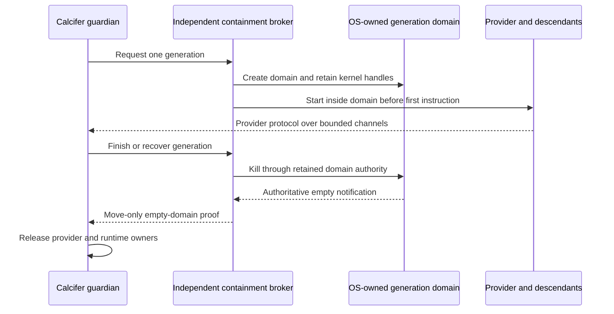

# ADR 0006: Platform-owned descendant containment

- Status: Accepted
- Date: 2026-08-13
- Scope: provider descendants that leave an owned process group

## Context

Calcifer owns exact direct-child handles and process groups created from those
children. Those authorities are sufficient for exact wait and ordinary tree
cleanup, but a provider descendant can call `setsid(2)` and leave the process
group. A PID, PGID, executable name, marker, path, or later process-table scan
cannot safely recreate ownership after that escape. Numeric identities may be
reused, and an observation cannot authorize a signal.

The stronger contract under consideration is whole-generation containment: no
successful provider release until every process descended from that generation
has left an operating-system-owned domain, followed by deterministic reclamation
of the domain. The domain must exist before untrusted provider code can run.

## Decision

Calcifer does not claim whole-generation containment on any currently supported
deployment. The existing exact-child/process-group contract remains unchanged.
A platform implementation may be enabled later only behind a separately
reviewed capability whose creator runs outside the provider domain and whose
ownership cannot be acquired by the provider's security principal.

The capability will be move-only and non-serializable. It must retain kernel
handles opened during domain creation; a path or numeric process identifier
cannot reconstruct it. Cleanup must first terminate the owned domain, then wait
for authoritative empty-state notification, and only then release provider and
runtime-storage ownership. Any timeout, replacement, identity mismatch, or
unsupported environment retains an explicit failure owner and cannot mint a
success capability.

If the final notification is absent or ambiguous, the last two arrows do not
occur and the failure owner remains retained.

### Linux cgroup v2

Linux cgroup v2 has the required kernel operations. `cgroup.kill` sends
`SIGKILL` to every process in a cgroup subtree and is defined to handle
concurrent forks and migrations. The recursive `populated` field in
`cgroup.events` reports whether the subtree still has any live processes.
Delegation containment prevents a less-privileged delegatee from moving a
process across a delegation boundary when it cannot write the common
ancestor's `cgroup.procs`.

Those primitives are necessary but not sufficient in Calcifer's current
rootless process model. Calcifer and the provider run as the same Unix user. A
subtree delegated directly to that user gives both processes the same
filesystem authority; a provider that can reach the writable delegated parent
can move itself into a sibling or parent cgroup. `Delegate=yes` by itself is
therefore not a security boundary between Calcifer and its provider.

A future supported Linux implementation must be created by an independent
system principal, such as a reviewed system service or containment broker. That
broker must:

1. create the generation cgroup before the provider is runnable;
2. place the provider into the domain without a post-spawn escape window;
3. prevent the provider from writing any cgroup outside its domain, including
   by exposing a restricted cgroup/mount namespace or no writable cgroupfs;
4. retain its own open control and event handles outside the domain;
5. disable every breakaway route and verify the domain cannot be replaced or
   adopted while live;
6. write `1` to the retained `cgroup.kill` handle, wait for recursive
   `populated 0`, and remove only the still-owned empty domain; and
7. return only fixed, payload-free failure categories.

The broker may run as root and launch the provider as the calling user, or be
supplied by a host service manager whose ownership boundary provides the same
properties. An ordinary login shell, an undelegated user session, cgroup v1,
and same-user raw cgroup delegation are unsupported. Lack of a broker is a
capability result, not permission to fall back to PID or process-table scans.

The authoritative interfaces are documented by the
[Linux kernel cgroup v2 documentation](https://docs.kernel.org/admin-guide/cgroup-v2.html)
and systemd's
[control-group delegation contract](https://systemd.io/CGROUP_DELEGATION/).

### Linux subreaper and PID namespaces

`PR_SET_CHILD_SUBREAPER` changes where an orphan is reparented and allows that
new parent to reap it after exit. It does not enumerate all live descendants,
prevent a live descendant from escaping a process group, or create signal
authority over an unknown PID. It may complement a future cgroup broker for
zombie collection, but cannot replace the cgroup ownership boundary.

A PID namespace has a stronger lifetime property: when its namespace init
exits, the kernel kills the namespace's remaining processes. It is not selected
for the current provider path. Rootless creation depends on host policy for
user namespaces; namespace init has special signal semantics; and changing the
provider's user, PID, mount, and `/proc` views is a compatibility and security
boundary that needs its own threat model. A future proposal may use a trusted
broker to create such a namespace, but it must not become a silent fallback for
missing cgroup authority. See the
[Linux PID namespace documentation](https://man7.org/linux/man-pages/man7/pid_namespaces.7.html).

### macOS

macOS exposes process groups and direct-child waits, but the reviewed public
surface does not expose a per-invocation, non-breakaway job object for arbitrary
CLI descendants. `launchd` and XPC manage installed jobs or services; they do
not turn an arbitrary same-user subprocess tree into a kill-and-empty
capability owned by its caller. Apple's launchd guidance also tells managed
daemons not to call `setsid(2)`, which is a cooperation rule rather than an
enforced absence proof.

The relevant public interfaces are described in Apple's
[Creating Launch Daemons and Agents](https://developer.apple.com/library/archive/documentation/MacOSX/Conceptual/BPSystemStartup/Chapters/CreatingLaunchdJobs.html)
and
[Creating XPC Services](https://developer.apple.com/library/archive/documentation/MacOSX/Conceptual/BPSystemStartup/Chapters/CreatingXPCServices.html).
Private sandbox profiles, reverse-engineered launchd behavior, process-table
walks, and Endpoint Security entitlements are not accepted product fallbacks.
macOS therefore remains unsupported for whole-generation containment.

### Windows

Windows Job Objects are the likely future implementation. With breakaway flags
disabled, child processes inherit the job; `JOB_OBJECT_LIMIT_KILL_ON_JOB_CLOSE`
terminates associated processes when the last job handle closes, and the job
can be waited until signaled. The process must be created suspended, assigned
before it runs, and resumed only after association succeeds. Nested-job and
already-in-job behavior require explicit tests. Windows implementation remains
out of scope for the current Unix supervisor; see Microsoft's
[Job Objects](https://learn.microsoft.com/en-us/windows/win32/procthread/job-objects)
documentation.

## Attack analysis

- **PID or PGID reuse:** never consulted to reconstruct the platform
  capability. Existing numeric metadata remains usable only while its retained
  exact child authority is live.
- **Domain path replacement:** a future broker must keep open kernel handles
  and compare the still-owned domain before removal. Reopening a path cannot
  authorize kill, empty proof, or deletion.
- **Same-user adoption or migration:** same-user delegation is unsupported.
  The provider must not be able to write a common ancestor or ask an accessible
  service-manager endpoint to move it outside the domain.
- **Fork during cleanup:** Linux support requires `cgroup.kill`, whose kernel
  contract covers concurrent forks and migrations, followed by recursive
  `populated 0`.
- **Owner crash:** crash or descriptor loss cannot publish provider release.
  Kill-on-close is useful catastrophic containment on platforms that supply it,
  but success still requires the explicit empty proof.
- **Runner teardown:** a CI runner, container runtime, or watchdog killing
  leftovers is failure containment only and never test evidence of product
  cleanup.

## Verification policy

There is no supported platform implementation in this decision, so a
setsid-detached whole-generation success test would make a false product claim.
Such a test becomes mandatory in the same change that introduces the first
broker-backed platform capability. It must run inside a host-provisioned
boundary rather than rely on runner teardown, and must cover normal cleanup,
concurrent fork, domain replacement, attempted migration/adoption, broker
failure, empty-proof timeout, and retained reader/pipe resources.

Existing tests continue to cover the narrower exact-child/process-group
contract and explicitly exercise a setsid-detached pipe owner as a fail-closed
timeout. Unsupported platforms must return no whole-generation capability.

## Recovery and rollback

The platform feature starts disabled because no current deployment can create
the required broker-backed capability. Enabling it later must be an explicit
configuration and capability negotiation, never auto-detection from a writable
cgroup path. Rollback disables that negotiation and returns to the documented
exact-child/process-group guarantee. It must not enable a PID scan, marker
lookup, name match, path reopen, unconditional kill, or premature scratch
deletion.
